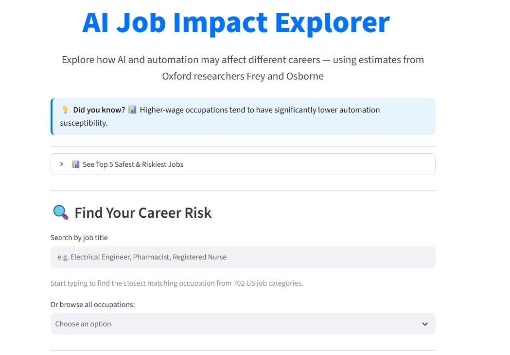
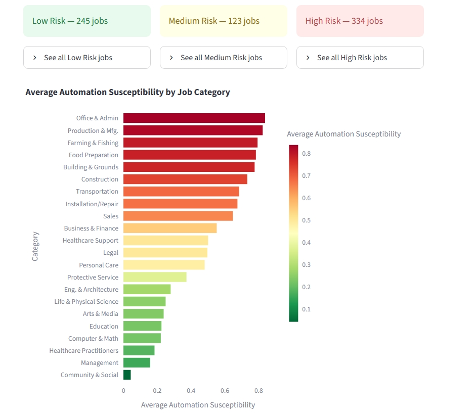
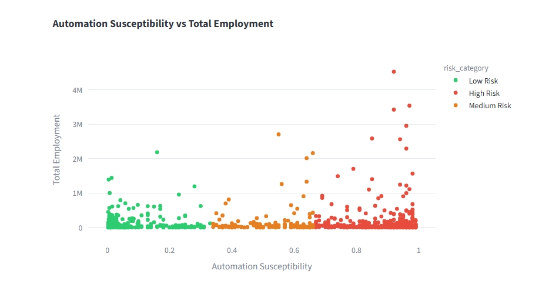
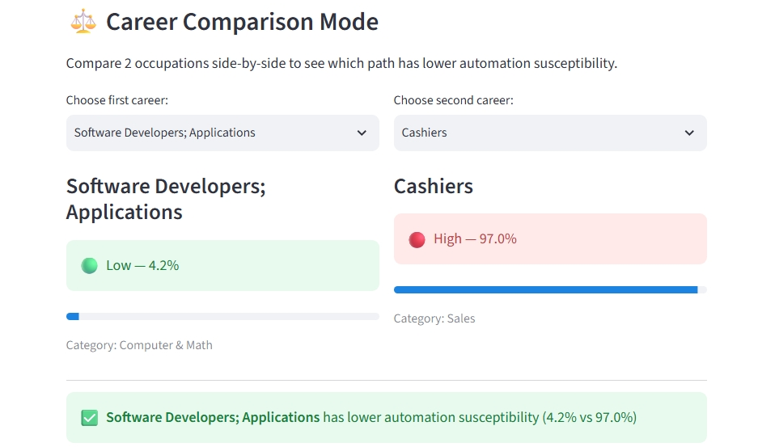

# 📊 US Job Automation Risk Analytics Platform

> Interactive labor market analytics for exploring how AI and automation may reshape careers and industries.

**Live App:** [us-ai-job-impact-predictor.streamlit.app](https://us-ai-job-impact-predictor.streamlit.app/)

[](https://python.org)
[](https://us-ai-job-impact-predictor.streamlit.app/)
[]()

---

## 📸 Screenshots

### Dashboard — Risk Classification & Career Search

> *Search any occupation and instantly see its automation risk score, risk category, and a plain-language interpretation.*

### Average Automation Risk by Job Category

> *Color-coded bar chart showing average automation exposure across 12+ job categories.*

### Automation Risk vs. Total Employment

> *Scatter plot mapping automation risk against employment size, color-coded by risk tier (Low / Medium / High).*

### Career Comparison Mode

> *Side-by-side view comparing the automation risk of two selected occupations.*

---

## Overview

The US Job Automation Risk Analytics Platform is a data-driven web application that helps users explore how AI and automation may affect different careers and industries. Built with Python and Streamlit, it classifies 700+ US occupations by automation risk score and provides plain-language contextual interpretations, career comparison, and skill recommendations.

Developed during my internship at **ThinkNeuro, LLC** as an independent data science project — 100 hours completed.

**Important note on methodology:** Automation probability scores in this application come directly from the source dataset (see Data Sources below). The application maps these scores into Low / Medium / High risk tiers using fixed thresholds and provides contextual interpretations based on risk category. This is a data analytics and visualization project, not a trained predictive ML model. Future improvements include integrating O*NET task-level data and training a feature-rich classification model.

---

## ✨ Features

- **Automation Risk Classification** — Classifies 700+ occupations across Low, Medium, and High risk tiers using dataset probability scores
- **Plain-Language Interpretations** — Contextual explanations of automation risk based on occupational category and risk level
- **Career Comparison Mode** — Side-by-side risk comparison of any two occupations
- **Safer Career Alternatives** — Suggests lower-risk career paths based on selected job category
- **Workforce Skill Guidance** — Highlights skill areas commonly identified in research as harder to automate or useful for adapting to AI-driven change
- **Interactive Data Visualizations**
  - Average automation risk by job category (color-coded bar chart)
  - Automation risk vs. total employment (scatter plot)
  - Top 5 safest and riskiest jobs

---

## 🗂️ Data Sources

See [`data/DATA_SOURCES.md`](data/DATA_SOURCES.md) for full citation details.

| Source | Role in Project |
|--------|----------------|
| Kaggle — US Labor Market Automation Risk Dataset | Primary dataset: 702 occupations with automation probability scores, SOC groups, and employment figures |
| Bureau of Labor Statistics (BLS) | Manual cross-reference for occupational category names and employment order-of-magnitude checks |

**Dataset breakdown:**
- **Total occupations:** 702
- **Low Risk** (probability ≤ 0.33): 245 jobs
- **Medium Risk** (probability 0.33–0.66): 123 jobs
- **High Risk** (probability > 0.66): 334 jobs

**Known limitations:**
- Automation probability scores come from the source dataset, not from a model trained in this project
- Employment figures reflect the dataset snapshot year (see DATA_SOURCES.md)
- Plain-language interpretations are contextual, not derived from O*NET task-level features

---

## ⚙️ How It Works

### Data Pipeline
```
automation_data_by_state.csv → Pandas cleaning → Risk tier mapping → Streamlit UI
```

### Risk Classification Logic
1. Each occupation has a raw automation probability score (0.0–1.0) from the dataset
2. Scores are mapped to three risk tiers:
   - Low: probability ≤ 0.33
   - Medium: probability 0.33–0.66
   - High: probability > 0.66
3. Plain-language contextual interpretations are generated based on risk tier and occupational SOC group
4. Career alternatives and skill recommendations are derived by filtering same-category occupations with lower risk scores

### Key Technical Challenges
- **Making risk scores interpretable:** Raw probability scores are meaningless to most users. Built a plain-language layer that translates scores into readable, actionable context
- **Career comparison state management:** Implemented dynamic side-by-side Streamlit state for real-time dual-occupation comparison without page reload
- **UI iteration:** Rebuilt the interface twice — moved from data-table outputs to visual risk indicators and color-coded categories

---

## 🛠️ Tech Stack

| Layer | Technology | Version |
|-------|-----------|---------|
| Language | Python | 3.10+ |
| Framework | Streamlit | 1.32.0 |
| Data Processing | Pandas | 2.2.1 |
| Visualization | Plotly | 5.20.0 |
| ML Utilities | Scikit-learn | 1.6.1 |
| Fuzzy Search | TheFuzz | 0.22.1 |
| Deployment | Streamlit Cloud | — |

---

## 📁 Project Structure

```
job-risk-app/
├── app.py                          # Main Streamlit application
├── README.md
├── requirements.txt
├── job_risk_model.pkl              # Trained classifier (scikit-learn 1.6.1)
├── label_encoder.pkl               # SOC group encoder
├── data/
│   ├── automation_data_by_state.csv  # Primary dataset
│   └── DATA_SOURCES.md               # Full data citations
├── assets/
│   ├── dashboard.jpg
│   ├── risk_by_category.jpg
│   ├── scatter_plot.jpg
│   └── comparison.jpg
└── .gitignore
```

---

## 🚀 Getting Started

```bash
# Clone the repository
git clone https://github.com/shrimaan-rapuru/job-risk-app.git
cd job-risk-app

# Install dependencies
pip install -r requirements.txt

# Run the app locally
streamlit run app.py
```

---

## 🔭 Future Improvements

- [ ] **O*NET task-level integration** — Incorporate task composition data (routineness, social intelligence, creative demands) to build a genuinely feature-rich classifier
- [ ] **Trained ML model** — Replace threshold-based classification with gradient boosting trained on O*NET + BLS features
- [ ] **Real-time BLS API** — Connect to BLS OEWS API for live employment data
- [ ] **Personalized risk profile** — Let users input specific skills to generate a custom score beyond job title alone
- [ ] **Historical trend view** — Show how automation risk has shifted over time using multi-year data
- [ ] **College major mapping** — Map occupations to common college majors for career-entry risk awareness

---

## 📖 Project Background

This project emerged from my interest in how AI is reshaping labor markets and my belief that people deserve clear, accessible tools to understand those shifts. The hardest part wasn't building the data pipeline — it was making automation risk scores interpretable for someone who has never encountered the concept before. That challenge — translating complex systems into tools people can actually use — is what I want to keep working on as an engineer.

---

## 👤 Author

**Shrimaan Rapuru**
[LinkedIn](https://linkedin.com/in/shrimaan-rapuru-439689329) · [GitHub](https://github.com/shrimaan-rapuru) · [Live App](https://us-ai-job-impact-predictor.streamlit.app/)
